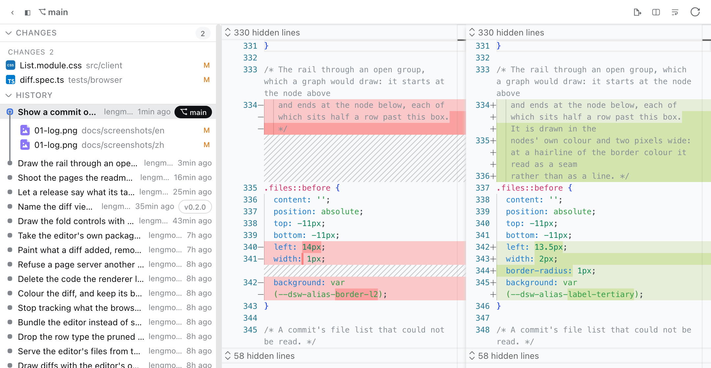
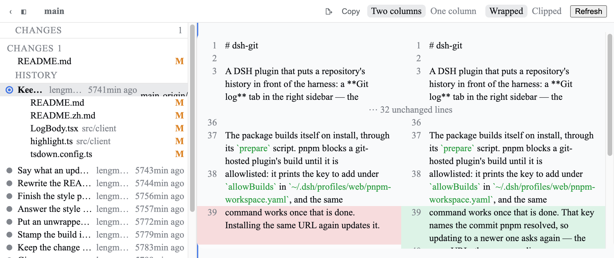
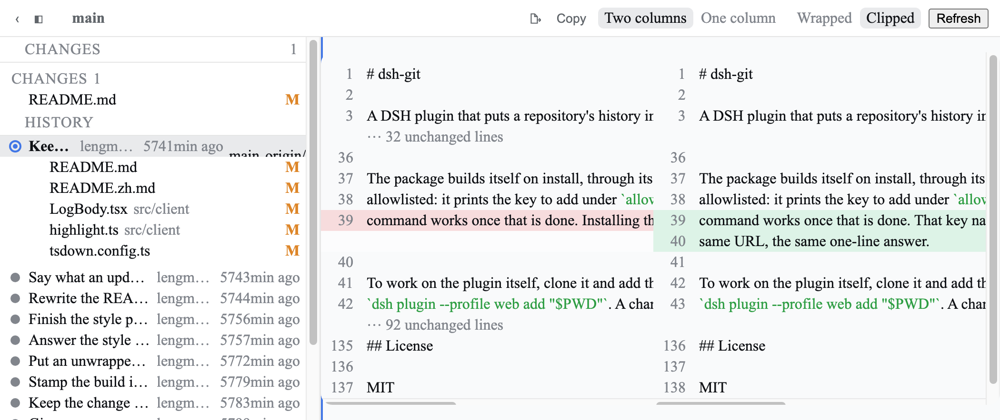
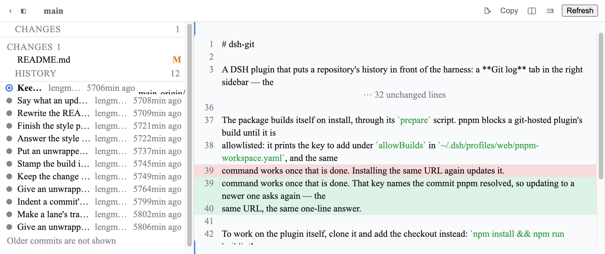

# dsh-git

A DSH plugin that puts a repository's history in front of the harness: a **Git log** tab in the right sidebar — the
working tree's changes and the recent commits — where a click on a change, or on a file inside a commit, opens a
read-only, syntax-highlighted, side-by-side diff in its own tab beside it.

English | [中文](README.zh.md)



| Two columns, wrapped | Two columns, unwrapped | One column |
| --- | --- | --- |
|  |  |  |

## What it does

- Contributes one page type to the right Sidebar: `+` opens the guide, **Git log** opens it in place.
- Draws the working tree the way the editor's source-control list does — conflicted, staged, unstaged, untracked — with
  the history below it, one commit per row, carrying its refs as chips.
- Expands a commit in place into the files it changed; a click on one opens that file's diff *for that commit*.
- Opens every diff as its own tab, addressed by what it shows. Two diffs stay open side by side instead of replacing
  each other, and a tab restored from an earlier session still resolves.
- Aligns with VS Code's own diff engine, highlights with the harness's own shiki setup, and says when a pairing is
  approximate rather than pretending it is exact.
- Reads only. No stage, no commit, no discard, no write to the working tree; every git process runs with
  `GIT_OPTIONAL_LOCKS=0`, so not even `git status` rewrites the index.

## Install

Needs Node 22.19+ (or 24+) and the DSH CLI.

```sh
dsh plugin --profile web add https://github.com/lengmoXXL/dsh-git
dsh --profile web
```

The package builds itself on install, through its `prepare` script. pnpm blocks a git-hosted plugin's build until it is
allowlisted: it prints the key to add under `allowBuilds` in `~/.dsh/profiles/web/pnpm-workspace.yaml`, and the same
command works once that is done. That key names the commit pnpm resolved, so updating to a newer one asks again — the
same URL, the same one-line answer.

To work on the plugin itself, clone it and add the checkout instead: `npm install && npm run build`, then
`dsh plugin --profile web add "$PWD"`. A change to the client half needs only `npm run build` — the server polls for the
new bundle and reloads the page over SSE. A change to the host half needs the server restarted.

## Use it

**Right sidebar `+` → Git log.** The tab lists the changes first, grouped, then the history. Clicking a change opens
its diff in a new tab in the same pane. Clicking a commit expands its file list under that row; clicking a file opens
that file's diff for that commit, and the next click opens another — nothing is replaced. Tabs can be dragged, split
into a second pane, or floated; that is the shell's behaviour, not this plugin's.

The diff's banner holds its own controls: two columns or one, wrapped or scrolling, and **Copy**. All four choices are
the reader's, kept in the browser, and follow every diff tab. A changed line is tinted rather than recoloured, so the
code stays readable, and a fold or an omission is stated with its own line counts.

The panel is a viewer, not an editor: there is nothing here to stage or commit.

## How it works

- **The host aligns; the browser draws.** No patch is parsed and no diff is computed in the browser: the host reads
  both sides of a file and aligns them with [`vscode-diff`](https://www.npmjs.com/package/vscode-diff) — the diff
  computer VS Code itself ships — so a row means what the editor would say it means, and two open views of one change
  cannot disagree.
- **The host half reaches the machine through `ctx.fs` and `ctx.subprocess`**, never `node:fs` or `child_process`. A
  deployment that routes those seams to another machine (`dsh-remote-ssh-worktree`, for instance) gets diffs of *that*
  machine's repository with no change here: the plugin asks the execution world, and the execution world knows where the
  repository is.
- **The workspace comes from the Session identity**, resolved on the host rather than from a path the browser supplies,
  and every path that does arrive from the browser is confined to the repository root before it reaches a git command.
- **The browser half shares exactly one runtime module with the shell** (the primitives package); every other Harness
  import is type-only. That is what lets it ship as one bundle the shell's loader already knows how to hold.
- **A page carries the build that drew it.** Hover the `abc^ → abc` label in a diff, or the repository name in the log,
  to read the timestamp of the bundle in front of you: a diff's content is read fresh from the host, while its layout
  comes from whatever bundle the page loaded.

## HTTP surface

The host half registers a `/dsh-git` prefix on `ctx.get('webServer')`. A profile without a web server (headless, SDK)
loads the plugin and simply has no tabs.

| Endpoint | Answers |
| --- | --- |
| `GET /dsh-git/status?sessionId=` | the repository, its branch and ahead/behind, every change |
| `GET /dsh-git/history?sessionId=&limit=&skip=` | one page of commits, with refs, author and time |
| `GET /dsh-git/commit?sessionId=&rev=` | one commit and the files it changed |
| `GET /dsh-git/diff?sessionId=&path=&origPath=&source=&rev=` | one change, aligned row by row |
| `GET /dsh-git/commit-diff?sessionId=&rev=` | one commit, an aligned diff per file |

`source` is `worktree`, `index` or `commit`. Failures answer `{ code, message }`, with a code of `session/unknown`,
`git/unavailable`, `git/not-a-repository`, `git/unknown-revision`, `git/path-outside-repo`, `git/bad-request` or
`git/command-failed`.

## Configuration

All optional, set in the profile's patch layer:

| Field | Default | Meaning |
| --- | --- | --- |
| `maxLines` | `4000` | rows one diff may return; past it the diff is cut to its changes and says what it left out |
| `maxBytes` | `2097152` | bytes one side may be read to |
| `historyLimit` | `50` | commits one history page may return |
| `maxEntries` | `2000` | changes one status answer may return |
| `maxCommitFiles` | `100` | files one commit's assembled diff may hold |
| `maxDiffMs` | `2000` | the diff computer's time budget; past it the pairing is marked approximate |

```yaml
- id: dsh-git
  config:
    historyLimit: 100
```

## Limitations

- **Read-only**: no stage, commit, discard or checkout.
- A merge commit is read against its first parent.
- A conflicted file's new side is the working tree, conflict markers and all; its old side prefers stage 2. There is no
  three-way view.
- Binary files are named rather than drawn, and there is no intraline highlighting.
- The syntax grammars are the plugin's own copy of the file view's setup: the loader resolves the shell's modules by
  package id, so the internal one is out of reach. `shiki` and `@shikijs/langs` are pinned to the versions the harness
  uses, and the colours come from the same `--shiki-*` palette.
- The log does not subscribe to filesystem changes; the refresh button is how it re-reads.

## Development

```sh
npm test            # build, then the unit and end-to-end suites
npm run typecheck   # host and client tsconfigs
npm run watch       # rebuild the client bundle as it changes
```

Most of the end-to-end suite asserts against the built bundle and its inlined CSS rather than against source, so a rule
that stops being emitted — or a class a component names but the stylesheet never defines — fails there.

## License

MIT
