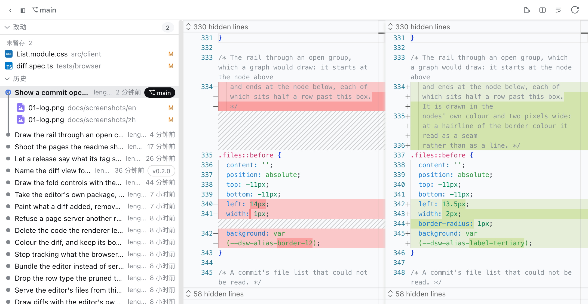
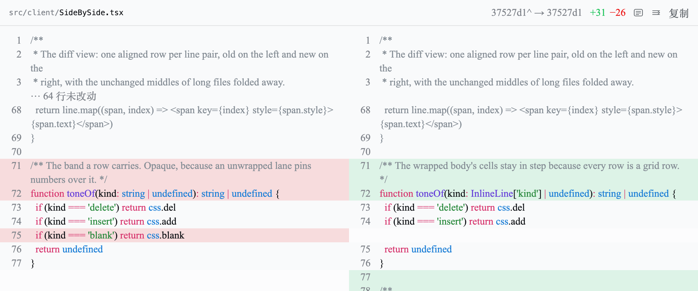
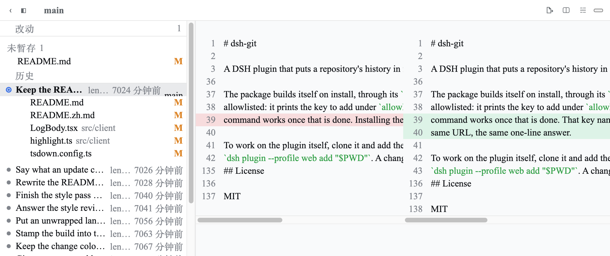
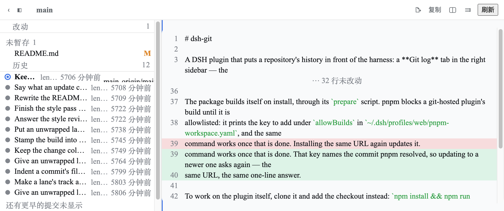

# dsh-git

一个 DSH 插件：给右侧栏加一个 **Git** 页面——左边是工作区改动与最近提交，右边是点开的 diff——只读、带高亮、双栏对齐。列表留在原地，所以两条 diff 可以并排比较。

[English](README.md) | 中文



| 双栏 · 折行 | 双栏 · 不折行 | 单栏 |
| --- | --- | --- |
|  |  |  |

## 安装

需要 Node 22.19+（或 24+）与 DSH CLI。

```sh
dsh plugin --profile web add @lengmoxxl/dsh-git
dsh --profile web
```

## 依赖、权限与限制

- `PATH` 上有 `git`，并且会话工作目录是一个 Git 工作区。
- 通过 Harness 文件系统读取该仓库，通过 Harness 子进程运行 `git`：不访问网络，不读凭据，不碰其他路径。
- 不写入任何东西——工作区和索引都不会被改动。命令以 DSH 进程自身的权限运行，仓库或 diff 很大时要花时间采集和绘制。

## 发布

在干净的 `main` 上：

```sh
npm version patch -m "Cut %s"   # 或 minor / major
npm publish
```

## License

MIT
